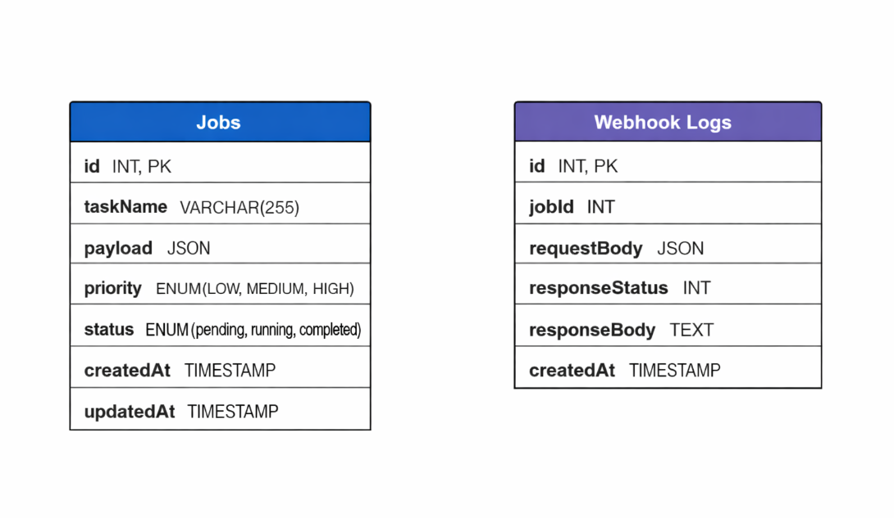

# Job Scheduler & Automation System

A simplified job scheduling and automation engine built as part of the **Dotix Technologies - Full Stack Developer Skill Test**.
The system allows users to create jobs, execute them, track their status, and trigger outbound webhooks upon completion.

---

## 1. Setup Instructions

### Prerequisites

* Node.js ≥ 18
* MySQL ≥ 8
* npm
* (Optional) Docker

---

### Backend Setup

```bash
cd backend
npm install
```

Create a `.env` file in `server/`:

```env
PORT=5000

DB_HOST=localhost # if using docker compose then use DB_HOST=mysql
DB_USER=<your user>
DB_PASSWORD=<your password>
DB_NAME=job_scheduler

WEBHOOK_URL=https://webhook.site/<your-unique-id>
```

Start the backend server:

```bash
npm run start
```

Backend will run at:

```
http://localhost:5000
```

---

### Frontend Setup

```bash
cd frontend
npm install
npm run build
npm run start
```

Frontend will run at:

```
http://localhost:3000
```

---

## 2. Tech Stack

### Frontend

* Next.js
* TailwindCSS
* Fetch API

### Backend

* Node.js
* Express.js
* Sequelize ORM
* REST APIs

### Database

* MySQL

### Integrations

* Webhook.site (external webhook testing)

---

## 3. Database Schema Design

### ER Diagram



---

### Jobs Table

| Column    | Type                              | Description          |
| --------- | --------------------------------- | -------------------- |
| id        | INT (PK, Auto Increment)          | Job identifier       |
| taskName  | VARCHAR(255)                      | Name of the job      |
| payload   | JSON                              | Job payload          |
| priority  | ENUM(LOW, MEDIUM, HIGH)           | Job priority         |
| status    | ENUM(pending, running, completed) | Job execution status |
| createdAt | TIMESTAMP                         | Job creation time    |
| updatedAt | TIMESTAMP                         | Job update time      |

---

### Webhook Logs Table

| Column         | Type      | Description               |
| -------------- | --------- | ------------------------- |
| id             | INT (PK)  | Log identifier            |
| jobId          | INT (FK)  | Associated job            |
| requestBody    | JSON      | Webhook payload sent      |
| responseStatus | INT       | HTTP status from webhook  |
| responseBody   | TEXT      | Webhook response or error |
| createdAt      | TIMESTAMP | Log timestamp             |


---

## 4. Architecture Explanation

This system follows a **layered architecture**:

### Frontend

* Responsible for UI, user interactions, and API consumption
* Uses Next.js App Router with client components
* No business logic lives on the frontend

### Backend

* Express handles HTTP routing
* Controllers manage request/response logic
* Services contain core business logic (job execution & webhook triggering)
* Sequelize abstracts database access

### Database

* MySQL stores jobs and webhook logs
* JSON column used for flexible payload storage

### Job Execution Flow

1. Job is created with status `pending`
2. User triggers execution
3. Job moves to `running`
4. Simulated processing (3 seconds)
5. Job completes
6. Webhook is triggered
7. Webhook result is logged

This separation ensures **maintainability, testability, and scalability**.

---

## 5. API Documentation

### Create Job

**POST** `/jobs`

```json
{
  "taskName": "Send Email",
  "priority": "HIGH",
  "payload": {
    "email": "test@example.com"
  }
}
```

---

### List Jobs

**GET** `/jobs`

Query Params:

* `status` (pending | running | completed)
* `priority` (LOW | MEDIUM | HIGH)

---

### Get Job by ID

**GET** `/jobs/:id`

Get Job by jobId.

---

### Run Job

**POST** `/jobs/run-job/:id`

Simulates execution and triggers webhook upon completion.

---

### Webhook Test Receiver (Optional)

**POST** `/webhook-test`

Used for local webhook testing.

---

## 6. How the Webhook Works

When a job finishes execution:

1. Backend sends a POST request to the configured webhook URL
2. Payload sent:

```json
{
  "jobId": 1,
  "taskName": "Send Email",
  "priority": "HIGH",
  "payload": {
    "email": "test@example.com"
  },
  "completedAt": "2025-01-01T12:00:00.000Z"
}
```

3. Webhook response (status + body) is logged in the database
4. Failures are captured and stored for observability

Webhook.site is used to validate outbound webhook behavior without owning the receiver system, simulating real third-party integrations.

---

## 7. AI usage log

### AI tool Used

ChatGPT

### Model name

GPT 5.2 - Flagship model

### Exact prompts used
- Prompt 1
```
"use client";

import { useEffect, useState } from "react";
import Link from "next/link";

const API = "http://localhost:5000";

export default function Dashboard() {
  const [jobs, setJobs] = useState([]);
  const [status, setStatus] = useState("");
  const [priority, setPriority] = useState("");

  const fetchJobs = async () => {
    let url = `${API}/jobs?`;
    if (status) url += `status=${status}&`;
    if (priority) url += `priority=${priority}`;

    const res = await fetch(url);
    const data = await res.json();
    setJobs(data);
  };

  useEffect(() => {
    fetchJobs();
  }, [status, priority]);

  const runJob = async (id) => {
    await fetch(`${API}/jobs/run-job/${id}`, { method: "POST" });
    fetchJobs();
  };

  return (
    <div>
      <Link href="/create">Create Job</Link>

      <h2>Filters</h2>
      <select onChange={(e) => setStatus(e.target.value)}>
        <option value="">All Status</option>
        <option value="pending">Pending</option>
        <option value="running">Running</option>
        <option value="completed">Completed</option>
      </select>

      <select onChange={(e) => setPriority(e.target.value)}>
        <option value="">All Priority</option>
        <option value="LOW">LOW</option>
        <option value="MEDIUM">MEDIUM</option>
        <option value="HIGH">HIGH</option>
      </select>

      <h2>Jobs</h2>
      <table border="1">
        <thead>
          <tr>
            <th>ID</th>
            <th>Task</th>
            <th>Priority</th>
            <th>Status</th>
            <th>Action</th>
          </tr>
        </thead>
        <tbody>
          {jobs.map((job) => (
            <tr key={job.id}>
              <td>
                <Link href={`/jobs/${job.id}`}>{job.id}</Link>
              </td>
              <td>{job.taskName}</td>
              <td>{job.priority}</td>
              <td>{job.status}</td>
              <td>
                <button
                  disabled={job.status !== "pending"}
                  onClick={() => runJob(job.id)}
                >
                  Run Job
                </button>
              </td>
            </tr>
          ))}
        </tbody>
      </table>
    </div>
  );
}

using tailwind css imporve the css for the current page, make it look more professional looking, colourful, vibrant, make this whole wrapped inside a container, have job dashboard as header then rest as the content of body
```

- Prompt 2
```
now similar to above theme modify the below code and add tailwind css classes
"use client";

import { useState } from "react";
import { useRouter } from "next/navigation";

const API = "http://localhost:5000";

export default function CreateJob() {
    const router = useRouter();
    const [taskName, setTaskName] = useState("");
    const [priority, setPriority] = useState("LOW");
    const [payload, setPayload] = useState("{}");

    const submit = async () => {
        await fetch(`${API}/jobs`, {
            method: "POST",
            headers: { "Content-Type": "application/json" },
            body: JSON.stringify({
                taskName,
                priority,
                payload: JSON.parse(payload)
            })
        });

        router.push("/");
    };

    return (
        <div>
            <h2>Create Job</h2>

            <input
                placeholder="Task Name"
                value={taskName}
                onChange={(e) => setTaskName(e.target.value)}
            />

            <select onChange={(e) => setPriority(e.target.value)}>
                <option value="LOW">LOW</option>
                <option value="MEDIUM">MEDIUM</option>
                <option value="HIGH">HIGH</option>
            </select>

            <textarea
                rows={10}
                value={payload}
                onChange={(e) => setPayload(e.target.value)}
            />

            <br />
            <button onClick={submit}>Create</button>
        </div>
    );
}
```

- Prompt 3
```
now similar to above theme modify the below code and add tailwind css classes

"use client";

import { useEffect, useState } from "react";
import { useParams } from "next/navigation";

const API = "http://localhost:5000";

export default function JobDetail() {
    const { id } = useParams();
    const [job, setJob] = useState(null);

    useEffect(() => {
        if (!id) return;

        fetch(`${API}/jobs/${id}`)
            .then((res) => res.json())
            .then(setJob);
    }, [id]);

    if (!job) return <p>Loading...</p>;

    return (
        <div>
            <h2>Job #{job.id}</h2>
            <p>Task: {job.taskName}</p>
            <p>Priority: {job.priority}</p>
            <p>Status: {job.status}</p>

            <h3>Payload</h3>
            <pre>{JSON.stringify(job.payload, null, 2)}</pre>
        </div>
    );
}
```

- Prompt 4
```
ironmanabhi@archlinux [~/Documents/GIT/Dotix] $ tree ./backend/ -I node_modules
./backend/
├── Dockerfile
├── package.json
├── package-lock.json
└── src
    ├── app.js
    ├── config
    │   ├── db.js
    │   └── env.js
    ├── controllers
    │   ├── job.controller.js
    │   └── webhook.controller.js
    ├── middlewares
    │   └── error.middleware.js
    ├── models
    │   ├── Job.js
    │   └── WebhookLog.js
    ├── routes
    │   ├── jobs.routes.js
    │   └── webhook.routes.js
    ├── server.js
    ├── services
    │   ├── jobRunner.service.js
    │   └── webhook.service.js
    └── utils
        ├── logger.js
        └── sleep.js

import express from "express";
import {
    createJob,
    listJobs,
    getJobById,
    runJob
} from "../controllers/job.controller.js";

const router = express.Router();

router.post("/", createJob);
router.get("/", listJobs);
router.get("/:id", getJobById);
router.post("/run-job/:id", runJob);

export default router;

import express from "express";
import { webhookTest } from "../controllers/webhook.controller.js";

const router = express.Router();

router.post("/webhook-test", webhookTest);

export default router;


import { Job } from "../models/Job.js";
import { runJobById } from "../services/jobRunner.service.js";

export const createJob = async (req, res, next) => {
    try {
        const { taskName, payload, priority } = req.body;

        if (!taskName || !payload || !priority) {
            return res.status(400).json({ message: "Missing fields" });
        }

        const job = await Job.create({
            taskName,
            payload,
            priority
        });

        res.status(201).json(job);
    } catch (error) {
        next(error);
    }
};

export const listJobs = async (req, res, next) => {
    try {
        const { status, priority } = req.query;
        const where = {};

        if (status) where.status = status;
        if (priority) where.priority = priority;

        const jobs = await Job.findAll({ where });
        res.json(jobs);
    } catch (error) {
        next(error);
    }
};

export const getJobById = async (req, res, next) => {
    try {
        const job = await Job.findByPk(req.params.id);
        if (!job) return res.status(404).json({ message: "Job not found" });

        res.json(job);
    } catch (error) {
        next(error);
    }
};

export const runJob = async (req, res, next) => {
    try {
        const job = await runJobById(req.params.id);
        res.json(job);
    } catch (error) {
        next(error);
    }
};

export const webhookTest = async (req, res) => {
    console.log("Webhook received:", req.body);
    res.json({ success: true });
};

Now write a concise but descriptive enought to describe the api workings, For API documentation in readme 
```

---

## Author

**Abhinav Yadav**
Full Stack Developer Skill Test - Dotix Technologies


